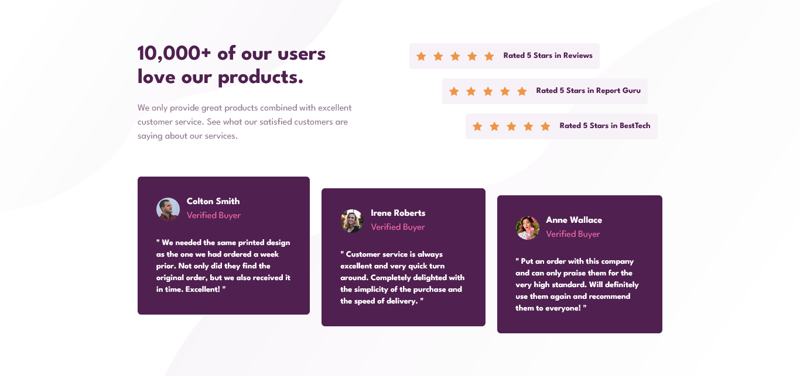

# Frontend Mentor - Social proof section solution

This is a solution to the [Social proof section challenge on Frontend Mentor](https://www.frontendmentor.io/challenges/social-proof-section-6e0qTv_bA). Frontend Mentor challenges help you improve your coding skills by building realistic projects.

## Table of contents

- [Overview](#overview)
  - [The challenge](#the-challenge)
  - [Screenshot](#screenshot)
  - [Links](#links)
  - [Built with](#built-with)
  - [What I learned](#what-i-learned)
- [Author](#author)

## Overview

### The challenge

Users should be able to:

- View the optimal layout for the section depending on their device's screen size

### Screenshot



### Links

- Solution URL: [Github](https://github.com)

### Built with

- Semantic HTML5 markup
- Tailwind
- Flexbox
- Mobile-first workflow
- [React](https://reactjs.org/) - JS library
- [Typescript](https://www.typescriptlang.org/) - extends JavaScript by adding types to the language.

### What I learned

Use this section to recap over some of your major learnings while working through this project. Writing these out and providing code samples of areas you want to highlight is a great way to reinforce your own knowledge.

To see how you can add code snippets, see below:

```js
function Rating({ description, id }: { description: string, id: number }) {
  return (
    <div
      className={`${
        id === 2 ? " lg:ml-14" : id === 3 ? "lg:ml-24" : ""
      } flex flex-col items-center gap-2 bg-lightGrayMagenta rounded p-3 lg:flex-row lg:gap-4 lg:self-start `}
    >
      <Star />
      <p className="text-sm font-bold text-darkMagenta">{description}</p>
    </div>
  );
}
```

## Author

- Frontend Mentor - [@Oloude](https://www.frontendmentor.io/profile/Oloude)
- Twitter - [@AbosedeOloude](https://www.twitter.com/AbosedeOloude)
